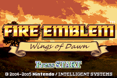

# Credits

Project Lead: **Lakka**

### Tech
---

FEBuilder and Patch Compatibility, Expand Sound Room, Unique Music Per Unit, CG Fade Glitch, Save File Colors, DismountEX, Remove Item / Send to Supply (Event), Silent give gold/items (Event), Multiple Escape Arrows, Supply Access by Chapter, Thracia Escape, Set Flag on Enemy Escape, Set/Get Unit Status (Event), Set Trap (Event) - **7743**

FE8 Skillsystem - **circleseverywhere, Sme, Pikmin1211, snakey1, Contro, Vesly, hypergammaspaces, Huichelaar, Pawkkie, Teraspark, stanh, MintX, Zeta-C, BGreenham, Leonarth, Shidesu, Runa, Darrman, Tequila, SD9k, crazycolorz, Kirb, primefusion**

Map Danger Zone, Actions after Talk, drumfix - **circleseverywhere**

Chapter Titles to Text - **7743, circleseverywhere**  
HP Bars - **circleseverywhere, Zane, Tequila**  
ExModularSave, Skip Difficulty Select, Leader AI Fix, Skip World Map, Unit Action Rework - **stanh**  
01command hack, 48command hack, Anti Huffman, CSA MagicSystem,  - **Hextator**  
Emotion Bubble - **7743, Kenpuku**  
Fix Weak Promoted Enemies- **Gryz**  
Force Boss Animation - **aera**  
MMB - **Scraiza, Zane, Pandan**  
Give Exp (Event) - **aera, Vesly**  
Melee / Ranged Spells - **Kao**  
Battle stats with anims off, fix lz77 decompress, Show Heal Amount - **Tequila**  
No Level Reset on Promotion - **Vesly, 7743**  
NarrowFont - **Scraiza**  
Native Instrument Map 2 - **Alusq**  
16 Tracks 12 Sounds - **Agro, Brendor**  
Fix dodge to front glitch - **snakey1**  
Improved Song Mixer - **ipatix**  
Remove Enemy Control Glitch - **Brendor**  

### Battle Animations
---
Armor Knight - **Iscaneus, Nuramon, flasuban**  
Axe Knight / Sword Knight (F) - **flasuban, Team Salvaged**  
Baron / General - **TBA, DerTheVaporeon, Nuramon**  
Bow Armor - **Team Salvaged**  
Brigand - **flasuban**  
Deserter - **Alusq**  
Fighter - **MK404**  
Fighter (F) - **Pikmin1211, Maiser6, MK404**  
Hoplite - **Nuramon**  
Horseman - **Leo Link**
Hunter - **Leo Link, Spud, Meat of Justice**  
Lance Knight / Sword Knight (M) - **Team Salvaged**  
Mage Knight (Sword) - **Aruka, Kenpuhu**  
Master Knight - **St Jack, Mycahel**  
Myrmidon (M/F) - **Leo Link**  
Mage (Hatless) - **GabrielKnight**  
Paladin (F) -  **Team Salvaged, flasuban, The Big Dededester**  
Paladin (M) - **Team Salvaged**  
Paladin (U/Helmet) - **Team Salvaged, MeteorSR23**  
Pegasus Knight - **flasuban**  
Sage (FE6 Style) - **IS, Shin19**  
Soldier - **flasuban, Nuramon, Leo Link**  
Thief - **Skitty, GabrielKnight (Pikmin1211, Maiser6 Repalette)**  
Troubadour (Swords) - **Teraspark**   
War Sage - **St. Jack**  
Warrior (F) - **Temp**  

### Map Sprites
---
Axe Armor - **Team Salvaged**  
Axe Knight - **Team Salvaged**  
Ballistician (Moving) - **DerTheVaporeon**  
Baron - **Warpath**  
Bow Armor - **Team Salvaged**  
Brigand - **flasuban**  
Deserter - **Alusq**  
Dismount Axe (F) - **shin19**  
Dismount Axe (M) - **ZoramineFae**  
Dismount Sword (M) - **teraspark**  
Fighter - **L95**  
Fighter (F) - **Pikmin1211**  
Hoplite - **circleseverywhere**  
Hunter - **MeatOfJustice**  
Lance Armor - **Team Salvaged**  
Lance Knight - **team Salvaged**  
Lance Knight (F) - **Team Salvaged, Pikmin1211**  
Lord (Aleksi) - **circleseverywhere**  
Mercenary (F) - **flasuban**  
Soldier - **flasuban**  
Supply Crates - **Primefusion**  
Sword Knight (F) - **flasuban**  
Troubadour - **Pimin1211, Maiser6, TBA**  
War Sage (F) - **Smug Mug, Unknown**  
Warrior (F) - **FEGirls**  

### Spell Animations
---
Myrskytuuli - **Golden Sun, Mikey Seregon**  
Thoron - **BwdYeti**  

### Portraits
---
Antero, Amalia, Anita, Heta, Hugo, Jaakko, Julius, Hallon, Kalle, Kristian, Lea, Sanna - **LaurentLacroix**  
Asta, Elias, Helmi, Maj, Johannes, Ingeborg, Roni, Kaija, Taru  - **XVI**  
Armas, Matias, Raisa, Sonja, Tobias - **flasuban**  
Kalevi, Monica, Sini, Viktor - **CapibaraInSpace**  
Linnea, Mira, Pilvi - **Levin64**   
Björn, Oliver - **ZoramineFae**  
Pentti, Risto - **RandomWizard**  
Aleksi - **Alusq**  
Lennart - **GabrielKnight**  
Lumi - **Scraiza**  
Niilo - **Peerless**  
Sakari - **Lenh**  
Ulla - **GaryTop**  

### Weapon/Item/Skill Icons
---
Earth Sword, Greatlance, Levis Lancea, Main Droite, Occult Scroll, Piercing Dagger, Stiletto - **Lisandra Brave**  
Estoc, Myrskytuuli, Pian Dao, Scimitar, Thoron, Ukonvasara - **LordGlenn**  
Energy Drop, Silencer, Throwing Knife - **Ereshkigal**  
Main Gauche, Sabre - **Peerless**  
Cutlass - **Zane**  
Dire Thunder - **OriharaSaki**  
Master Seal - **Purple**  
Spirit Dust - **GabrielKnight**  
Scissor Axe - **Zane**  
Kalis - **SacredStones**  
Wing Spear - **Seal, SacredWar**  
Wooden Bow - **snakey1**  
Slim Sword, Wo Dao - **2WB**  
Levin Sword - **Zelix**  
Seafarer Icon - **ZessDynamite, rainlash**  

### Class Cards
---
Axe/Lance/Sword Knight, Axe/Lance/Bow Armor - **Team Salvaged**  
Ballistician - **Aruka, Yggdra**  
Deserter - **Rasdel**  

### Tilesets
---
Lava Cave, Swamp - **HyperGammaSpaces**  
Super Fields - **Wave, RandomWizard**  
Updated Fort - **ZoramineFae**  
Updated Snow Fields - **N426**  
Updated Village - **ZoramineFae, Venno, N426**  

### Music
---
Battle with Thimale, Boss (FE2), Cassandra, Cavern of Splendor, Fillmore, Forbidden Forest, Endless Battle, Heaven's Rock Seat, Knights of Razelia, Thunder, Trisection, Wall of Defense - **Alusq**

Boss II (Chrono Trigger), Boss Battle (Mystery Dungeon), Chapel Halls, A Knight's Oath, Mt. Thunder, Rise to the Challenge - **RandomWizard**

Battle in the Abandoned Church, Gordon Sortie, Leaps and Bounds, Onset, Stronger Monsters, The Time to Act, Vs Arvis - **Saxor the Nobody**

Footsteps of Fate, Attack (FE11), Defend (FE11), For Liberty, Sinistral Battle - **Sme**

Alm Map 1, Celica Map 1, Defend 1 (FE2), Preparations (FE5) - **hypergammaspaces**

Attack (FE6), Arena, Battle 2 (Chrono Trigger), Saturos Battle - **TristanHollow**

Field, Heaven's Gate, Quickly Difficult - **Pikmin1211**

Attack (FE4), Army of Verdane, From Foe to Friend - **Pandan**

Defend (FE4), Saturos/Menardi - **MrGreen**  
Attack (FE5) - **DerTheVaporeon**  
Encounter with the Renegades - **AReliableChair**  
Isaac's Theme - **MeatofJustice**  
Victory (FE5) - **Dolkar**  

### Background Images
---
Stat Screen Background - **epicer**  
Title Screen Background - **ZoramineFae**
